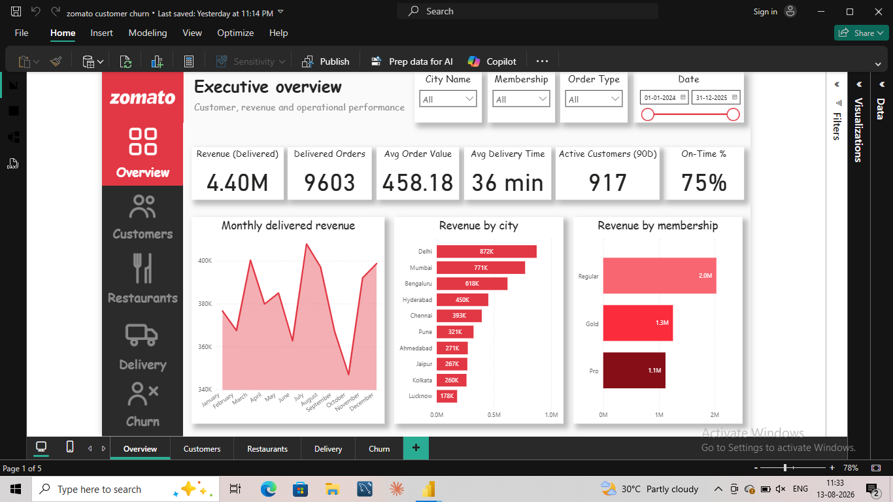
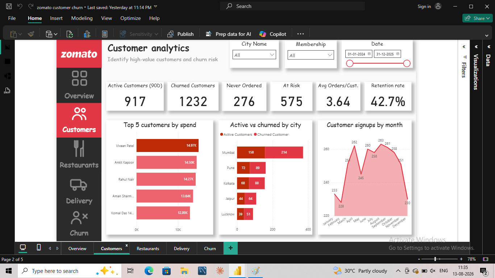
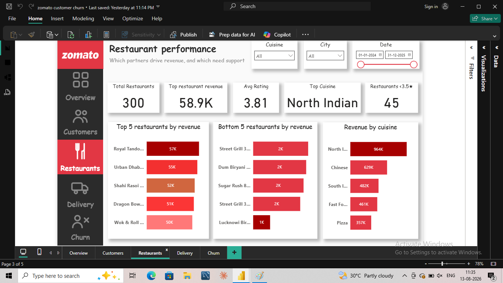
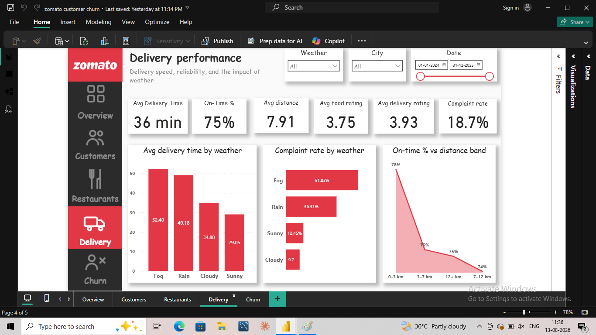
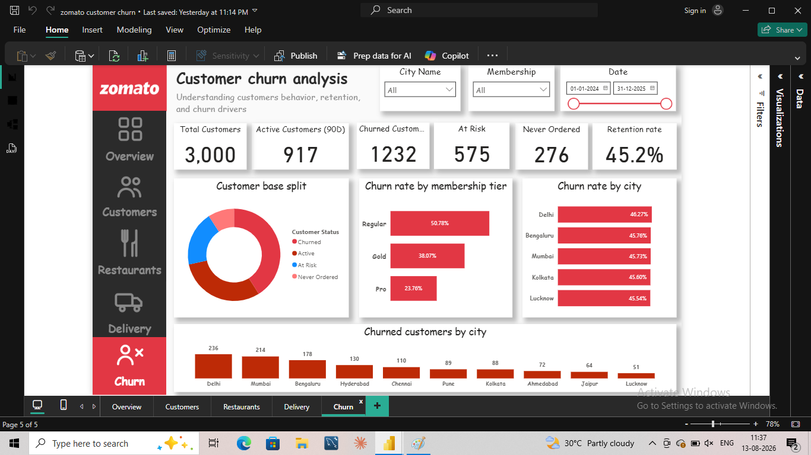

# 🍽️ Zomato Customer Churn & Business Performance Analysis


> **End-to-end Data Analyst case study using MySQL, SQL, Power BI, DAX and Excel to analyze customer churn, retention, revenue, restaurant performance and delivery operations.**

---

## 📌 Project Overview

This project simulates a Zomato-style food-delivery business and follows a complete Data Analyst workflow:

**Data validation → SQL analysis → Power BI/DAX modeling → Dashboard → Business insights → Recommendations**

### Business Questions

- Where is revenue being generated?
- Which customers are active, at risk, churned or have never ordered?
- Which customers and membership tiers are most valuable?
- Which restaurants and cuisines drive revenue?
- Does delivery distance affect on-time performance?
- How does weather affect delivery time and complaints?
- Which cities and customer segments show higher churn?

---

## 🛠️ Tools & Technologies

| Tool | Purpose |
|---|---|
| **MySQL / SQL** | Data validation and business analysis |
| **Power BI** | Interactive dashboard and data storytelling |
| **DAX** | KPI and analytical measures |
| **Power Query** | Data preparation and transformation |
| **Excel** | Source data preparation |

---

## 🗂️ Dataset & Data Model

The final model contains **9 related tables**:

| Table | Rows | Purpose |
|---|---:|---|
| `cities` | 10 | City master data |
| `memberships` | 3 | Membership tiers |
| `customers` | 3,000 | Customer profiles and signup data |
| `restaurants` | 300 | Restaurant partners and cuisines |
| `menu_items` | 50 | Menu item master data |
| `orders` | 10,000 | Order transactions |
| `order_items` | 21,055 | Items within orders |
| `deliveries` | 6,690 | Delivery time, distance and weather |
| `feedback` | 5,687 | Ratings and complaints |

### Key relationships

`customers → cities / memberships`  
`orders → customers / restaurants`  
`order_items → orders / menu_items`  
`deliveries → orders`  
`feedback → orders`

See the full [data dictionary](docs/data_dictionary.md).

---

# 🔍 Data Quality & Validation

Data was validated before dashboard development. Checks include:

- Row-count validation
- Duplicate primary-key checks
- Important NULL checks
- Orphan customer references
- Orphan restaurant references
- Invalid order amounts
- Invalid ratings
- Referential consistency checks

The purpose was to make sure business conclusions were based on reliable relationships and valid records.

---

# 🧮 SQL Analysis

The SQL script contains **30 numbered business questions**, plus data-quality and schema-validation queries.

### Main analysis areas

- Business overview and revenue
- Cancellation rate
- Monthly revenue and growth
- Membership performance
- Repeat vs one-time customers
- Customer lifetime value
- Inactive customers
- Monthly customer retention
- City and age-group segmentation
- Restaurant and cuisine performance
- Menu-item revenue
- Top restaurants by city
- Delivery time and distance
- Weather impact
- Delivery ratings and complaints
- Customer value by city
- Cumulative revenue
- City-level AOV benchmarking
- Executive KPI summary

### SQL techniques demonstrated

`JOIN` • `GROUP BY` • `HAVING` • `CASE WHEN` • Subqueries • CTEs • `RANK()` • `DENSE_RANK()` • `ROW_NUMBER()` • `LAG()` • Window functions • `COUNT(DISTINCT ...)`

### ⭐ Selected SQL questions

| Question | Analysis | Screenshot |
|---:|---|---|
| **Q8** | Top customers by lifetime value | [View](sql/screenshots/customer_lifetime_value.png) |
| **Q10** | Inactive customers | [View](sql/screenshots/inactive_customers.png) |
| **Q12** | Monthly customer retention | [View](sql/screenshots/customer_retention.png) |
| **Q18** | Top restaurant in each city | [View](sql/screenshots/top_restaurant_by_city.png) |
| **Q19** | Top 3 restaurants in every city | [View](sql/screenshots/top_3_restaurants_by_city.png) |
| **Q22** | Delivery time by weather | [View](sql/screenshots/delivery_time_weather.png) |
| **Q28** | Cumulative revenue | [View](sql/screenshots/cumulative_revenue.png) |
| **Q29** | Restaurant vs city AOV | [View](sql/screenshots/city_aov_benchmark.png) |

The complete script is available at [`sql/Zomato_Customer_Churn_SQL.sql`](sql/Zomato_Customer_Churn_SQL.sql).

---

# 📊 Power BI Dashboard

The report contains **5 analytical pages** designed around business questions rather than just charts.

## 1️⃣ Executive Overview

**Question:** *How is the business performing?*

KPIs include delivered revenue, delivered orders, AOV, average delivery time, active customers and on-time delivery rate.



## 2️⃣ Customer Analytics

**Question:** *Who are the highest-value and highest-risk customers?*

Includes active customers, churned customers, never-ordered customers, average orders/customer, top customer spend, retention and city-level customer comparison.



## 3️⃣ Restaurant Performance

**Question:** *Which restaurant partners drive revenue and which need support?*

Includes top/bottom restaurants, average rating, top cuisine and revenue by cuisine.



## 4️⃣ Delivery Performance

**Question:** *What affects delivery reliability and customer experience?*

Includes delivery time, on-time rate, distance, complaints, food rating, delivery rating and weather analysis.



## 5️⃣ Churn Analysis

**Question:** *Where is customer loss concentrated?*

Includes active, churned and never-ordered customers, churn rate, churn by membership and churn by city.



---

# 👥 Customer Status Definitions

The project intentionally keeps **At Risk** separate from **Churned** because they represent different business actions.

### Active Customer (90D)
A customer with delivered-order activity inside the defined 90-day activity window.

### At Risk
A customer identified by the project's customer-status logic as showing reduced/inactive behavior but not yet classified as fully churned.

### Churned Customer
A previously active/order-making customer who has exceeded the project's inactivity threshold.

### Never Ordered
A registered customer with no delivered-order history.

### Retention Rate
The dashboard calculates retention among the active/churned population:

`Active Customers / (Active Customers + Churned Customers)`

`Never Ordered` customers are excluded because they were never retained customers in the first place.

---

# 💡 Business Insights

The dashboard is designed to surface insights such as:

1. Customer retention is a major opportunity when a large share of the previously active base is no longer active.
2. Churn concentration by city can support targeted retention campaigns.
3. Membership-level differences can help design more relevant retention offers.
4. Longer delivery distances and adverse weather can be investigated as operational risk factors.
5. Revenue concentration by restaurant and cuisine can support partner benchmarking.
6. Low-rated and low-revenue restaurants can be identified for targeted partner support.

> **Important:** KPI values are filter-dependent. The PBIX file is the source of truth for interactive results.

---

# 🎯 Business Recommendations

Based on the analysis, a food-delivery business could:

- Prioritize high-value customers for retention/reactivation campaigns.
- Target high-churn cities with localized offers.
- Use membership-specific retention incentives.
- Investigate long-distance routes with poor on-time performance.
- Plan delivery capacity for adverse weather conditions.
- Provide targeted support to low-rated or low-revenue restaurant partners.
- Use high-performing restaurants and cuisines as benchmarks.

---

# 📁 Repository Structure

```text
Zomato-Customer-Churn-Analysis/
│
├── README.md
│
├── data/
│   └── Zomato_Customer_Retention.xlsx
│
├── powerbi/
│   └── Zomato_Customer_Churn.pbix
│
├── sql/
│   ├── Zomato_Customer_Churn_SQL.sql
│   └── screenshots/
│       ├── data_quality.png
│       ├── customer_lifetime_value.png
│       ├── inactive_customers.png
│       ├── customer_retention.png
│       ├── top_restaurant_by_city.png
│       ├── top_3_restaurants_by_city.png
│       ├── delivery_time_weather.png
│       ├── cumulative_revenue.png
│       └── city_aov_benchmark.png
│
├── docs/
│   ├── data_dictionary.md
│   ├── dax_measures.md
│   └── interview_guide.md
│
└── screenshots/
    ├── executive_overview.png
    ├── customer_analytics.png
    ├── restaurant_performance.png
    ├── delivery_performance.png
    └── churn_analysis.png
```

---

# 🎤 Interview Pitch

> **I built an end-to-end food-delivery analytics case study using MySQL, SQL, Power BI and DAX. I first validated a 9-table relational dataset and performed 30 business-focused SQL analyses covering revenue, customer behavior, retention, restaurant performance and delivery operations. I then built a five-page Power BI dashboard with DAX-based KPIs to identify churn patterns, revenue drivers and operational bottlenecks, and translated those findings into business recommendations.**

### Questions I can defend

- Why did you choose a 90-day activity definition?
- Why keep At Risk separate from Churned?
- How did you calculate retention?
- Why use `COUNT(DISTINCT customer_id)`?
- Why use delivered orders for revenue?
- How did you use CTEs and window functions?
- How did you build the customer-status logic?
- How does delivery distance relate to on-time performance?
- What action would you take to reduce churn?
- What would you improve with real production data?

See the complete [interview guide](docs/interview_guide.md).

---

# 🧠 Skills Demonstrated

### SQL
Joins • Aggregations • CTEs • Subqueries • Window Functions • Ranking • Customer Analytics • Retention Analysis

### Power BI
Data Modeling • Power Query • KPI Cards • Slicers • Interactive Dashboards • Data Storytelling

### DAX
Revenue • Customer Segmentation • Retention • Delivery KPIs • Operational Metrics

### Business Analysis
Customer Churn • Customer Retention • Revenue Drivers • Restaurant Performance • Delivery Operations • Root-Cause Thinking • Recommendations

---

## 📌 Portfolio Note

This is a **portfolio/analytical dataset** structured to simulate a food-delivery business. It does not represent Zomato's proprietary internal data.

## 🚀 Project Status

**Completed — portfolio and interview ready.**

The repository includes the source data, SQL analysis, selected SQL-result screenshots, Power BI report, dashboard screenshots, DAX documentation, data dictionary and interview preparation guide.
